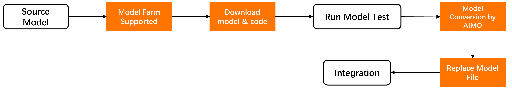

# APLUX Model Farm

## Overview

To accelerate evaluation AI model performance on target edge devices, APLUX builds the [Model Farm](https://aiot.aidlux.com/en/models). Model Farm contains hundreds of mainstream open-source models with different functions, optimized for different hardware platforms, and provides benchmark performance reference based on real testing. Developers can quickly finish evaluations according to their actual requirements without investing substantial costs and time costs.

At the same time, Model Farm also provides ready-to-run model inference example code, greatly reducing the difficulty and workload for developers to test model performance and develop AI application on edge devices, shortening the entire process time and accelerating solution deployment.

## Features

Specifically, Model Farm can help developers accomplish the following:

- Query AI model performance reference on specific Qualcomm chip
- Download optimized AI models (leveraging NPU for acceleration inference)
- Download pre/post-processing and model inference example code
- View model conversion & optimization steps, which help developers to optimize their own fine-tuned models quickly

**Models on Model Farm**

**Fine-tuned Models by User**

## Support Matrix

| Chip / Compute Unit | CPU | GPU | NPU |
| ------------------- | --- | --- | --- |
| QCS8550             | ✔   | ✔   | ✔   |
| QCS6490             | ✔   | ✔   | ✔   |

## Recent updates
📣 **2025.09.30**
- Support Qwen3-4B (Preview Section)
- Support π0 (Preview Section)
📣 **2025.09.16**
- [Model Farm Preview](https://aiot.aidlux.com/en/models/preview) Section is Now Live

## Resources

- [Model Farm](https://aiot.aidlux.com/en/models)
- [Model Farm User Guide](https://docs.aidlux.com/en/guide/software/ai-platform-portal-modelFarm)
- [AI Model Optimizer (AIMO)](https://aimo.aidlux.com/#/login)
- [AidLite SDK](https://docs.aidlux.com/en/guide/software/sdk/aidlite/aidlite-sdk)

## Quick Start

- Hardware & Software Preparation please refer to [Preparation](https://docs.aidlux.com/en/guide/software/ai-platform-portal-modelFarm#preparation)
- Log in please refer to [Log in to Model Farm](https://docs.aidlux.com/en/guide/software/ai-platform-portal-modelFarm#log-in-to-model-farm)
- View Model please refer to [View Models](https://docs.aidlux.com/en/guide/software/ai-platform-portal-modelFarm#view-models)
- Download Model please refer to [Download Models](https://docs.aidlux.com/en/guide/software/ai-platform-portal-modelFarm#download-models)
- Test model please refer to [Test Models](https://docs.aidlux.com/en/guide/software/ai-platform-portal-modelFarm#test-models)

## Advanced Usage

If you want to deploy your own fine-tuned model (already adapted on Model Farm), please refer to [Convert Fine-tuned Models](https://docs.aidlux.com/en/guide/software/ai-platform-portal-modelFarm#convert-fine-tuned-models)

## Use Case

- [Deploy YOLOv5s](https://docs.aidlux.com/en/guide/software/ai-platform-portal-modelFarm#deploy-yolov5s)

## Contact Us

- [contact APLUX](mailto:liuweibin@aidlux.com?cc=huangwenbo@aidlux.com) 
